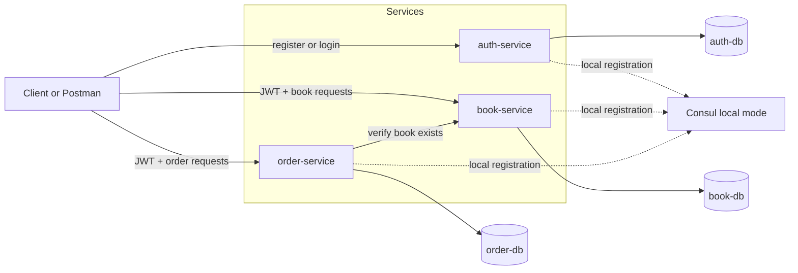
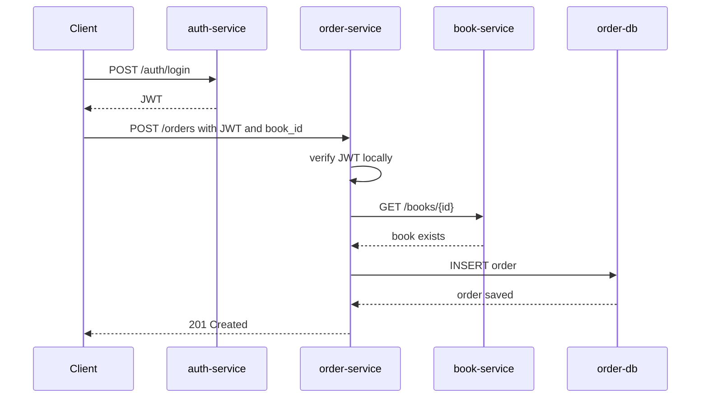

# Book Order Demo Design

## Goal

Build the smallest microservices project that still satisfies the course requirements.

This project is a demo-only book ordering system with:

- 3 microservices
- separate PostgreSQL database containers for each service
- JWT authentication
- 2 user roles: `customer` and `staff`
- service discovery
- Docker Compose for local development
- Kubernetes manifests for local deployment
- basic testing, CI/CD, and monitoring

## Scope

### In Scope

- user registration and login
- role-based access control with JWT
- book catalog management
- order creation and listing
- service-to-service communication between microservices
- service discovery with Consul locally
- Docker and Kubernetes deployment

### Out of Scope

- frontend UI
- refresh tokens
- email verification
- password reset
- payment processing
- real notifications
- message queues
- API gateway

## Architecture

The system consists of three services:

1. `auth-service`
2. `book-service`
3. `order-service`

Each service has:

- its own codebase
- its own PostgreSQL database container
- its own Dockerfile
- its own Kubernetes Deployment and Service

### Communication

- Clients log in through `auth-service` and receive a JWT.
- Clients send the JWT to `book-service` and `order-service`.
- `book-service` and `order-service` verify the JWT locally using the shared `JWT_SECRET`.
- `order-service` calls `book-service` over HTTP to confirm that a requested book exists before creating an order.
- In local Docker Compose mode, services register themselves with Consul.
- In Kubernetes mode, services communicate through Kubernetes Service DNS.

This keeps the architecture simple while still demonstrating real microservice communication.

### Service Discovery Strategy

To satisfy the service discovery requirement without overengineering:

- use Consul for local service registration and discovery
- use native Kubernetes Service DNS inside the cluster

This gives the project an explicit discovery mechanism for the demo while keeping Kubernetes deployment simple.

### Architecture Diagrams

#### Service Interaction Diagram

#### Order Creation Sequence Diagram

## Services

### 1. auth-service

Purpose:
- register users
- authenticate users
- issue JWTs

Database:
- PostgreSQL container: `auth-db`

Main fields in `users` table:
- `id`
- `name`
- `email`
- `password_hash`
- `role` (`customer` or `staff`)
- `created_at`

Endpoints:
- `POST /auth/register`
- `POST /auth/login`
- `GET /auth/health`

Rules:
- both `customer` and `staff` accounts can log in
- passwords are stored as hashes
- successful login returns a JWT containing `userId`, `email`, and `role`

### 2. book-service

Purpose:
- manage the book catalog

Database:
- PostgreSQL container: `book-db`

Main fields in `books` table:
- `id`
- `title`
- `author`
- `price`
- `stock`
- `created_at`

Endpoints:
- `GET /books`
- `GET /books/:id`
- `POST /books`
- `PUT /books/:id`
- `DELETE /books/:id`
- `GET /books/health`

Authorization:
- `customer`: can read books
- `staff`: can create, update, and delete books

### 3. order-service

Purpose:
- create and list orders

Database:
- PostgreSQL container: `order-db`

Main fields in `orders` table:
- `id`
- `customer_id`
- `book_id`
- `quantity`
- `status`
- `created_at`

Endpoints:
- `POST /orders`
- `GET /orders`
- `GET /orders/:id`
- `GET /orders/health`

Authorization:
- `customer`: can create orders and view their own orders
- `staff`: can view all orders

Business flow:
1. customer sends JWT and order request
2. `order-service` verifies the JWT
3. `order-service` resolves `book-service` through Consul in local mode, or through Kubernetes DNS in cluster mode
4. `order-service` calls `book-service` to verify the book exists
5. `order-service` stores the order in its own database

## Roles

### Customer

- register and log in
- view books
- create orders
- view their own orders

### Staff

- log in
- create books
- update books
- delete books
- view all orders

## Tech Stack

- Backend: Python, FastAPI, Uvicorn
- Database: PostgreSQL
- Database Access: psycopg with plain SQL
- Auth: PyJWT, passlib with bcrypt
- HTTP Client: httpx
- Testing: pytest
- Containers: Docker, Docker Compose
- Service Discovery: Consul
- Orchestration: Kubernetes
- Monitoring: Prometheus and Grafana
- Centralized Logging: Fluentd, Elasticsearch, Kibana
- CI/CD: GitHub Actions

Implementation notes:

- keep the backend simple and avoid overengineering
- use plain SQL instead of an ORM
- use simple SQL initialization scripts instead of a migration framework
- keep each service small and focused on one responsibility
- keep each service implementation in a single Python file: `app.py`
- use a root virtual environment folder named `venv`

## Project Structure

The project will start with this minimal structure:

- `venv/`
- `services/auth-service/app.py`
- `services/book-service/app.py`
- `services/order-service/app.py`
- `requirements.txt`
- `docker-compose.yml`
- `k8s/`
- `.github/workflows/`

## Implementation Order

Build the project in this order:

1. update the design and lock the stack to Python and FastAPI
2. create the folder structure for the three services, Docker Compose, Kubernetes manifests, and CI workflow
3. build `auth-service` first with registration, login, password hashing, JWT generation, and health check
4. build `book-service` second with book CRUD and role-based access for `staff`
5. build `order-service` third with order creation, order listing, and the call to `book-service`
6. add Consul registration and discovery after all three APIs work locally
7. Dockerize all services and databases, and make sure app containers do not run as root
8. add unit, integration, and end-to-end tests
9. add Kubernetes manifests including Deployment, Service, ConfigMap, Secret, and HPA for `order-service`
10. add monitoring and CI/CD last

This order gets a working demo ready as early as possible and leaves lower-priority platform work for later.

## Local Development with Docker Compose

Docker Compose will start:

- `consul`
- `auth-service`
- `auth-db`
- `book-service`
- `book-db`
- `order-service`
- `order-db`

Purpose:
- fast local testing
- easy API demo
- easy service-to-service verification
- explicit service discovery demo using Consul

### Consul Usage

For local demo mode:

- each microservice registers itself with Consul
- each microservice exposes a health endpoint for registration checks
- `order-service` resolves `book-service` through Consul before making internal API calls

This is enough to demonstrate service registration and discovery without adding a service mesh or advanced networking features.

## Kubernetes Deployment

For each service, Kubernetes manifests will include:

- `Deployment`
- `Service`
- `ConfigMap`
- `Secret`

Additional manifests:

- PostgreSQL deployments and services for each database
- HPA for `order-service`
- RBAC
- NetworkPolicy
- Prometheus
- Grafana

### Service Discovery

Local environment:
- Consul will be used for service registration and discovery

Kubernetes environment:
- Kubernetes Service DNS will be used for service discovery

Example:
- local mode: `order-service` discovers `book-service` from Consul
- Kubernetes mode: `order-service` calls `book-service` using the Kubernetes service name

## Security

To keep the project simple but acceptable:

- JWT is required for protected routes
- passwords are hashed
- secrets are stored in environment variables and Kubernetes Secrets
- containers will avoid running as root where practical
- basic RBAC and NetworkPolicy files will be included

## Testing Plan

### Unit Tests

- auth logic
- JWT middleware
- role authorization checks
- order creation logic

### Integration Tests

- `order-service` calling `book-service`
- Consul registration and lookup in local mode
- database operations for each service

### End-to-End Test

Simple demo flow:
1. register or log in as staff
2. create a book
3. log in as customer
4. fetch the book list
5. create an order
6. verify the order appears in the database/API

## CI/CD Plan

GitHub Actions pipeline will:

1. install dependencies
2. run tests
3. build Docker images
4. create a local Kind cluster in CI
5. apply Kubernetes manifests
6. run a smoke test against the deployed services

This is enough for the course demo without adding unnecessary complexity.

## Monitoring and Logging

Monitoring:
- Prometheus collects basic metrics from the services
- Grafana displays a simple dashboard

Logging:
- use container logs for local debugging
- use Kubernetes pod logs for cluster debugging

This keeps observability simple and demo-friendly.

## Demo Flow

The final demo can follow this sequence:

1. start the system with Docker Compose or Kubernetes
2. register or log in as `staff`
3. create a book
4. log in as `customer`
5. view the book catalog
6. create an order
7. show that services are registered in Consul
8. show the order in `order-service`
9. show Prometheus/Grafana briefly

## Why This Design

This design is intentionally minimal:

- only 3 services
- same database technology for every service
- simple business logic
- clear JWT and role-based authorization
- explicit service discovery with minimal extra setup
- enough microservice communication to satisfy the rubric
- practical to finish in limited time
